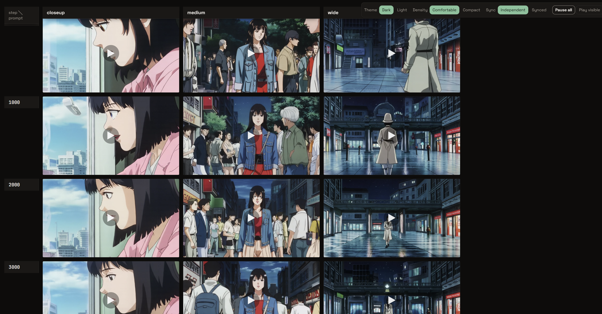

# finetune-gridwatch

[](https://github.com/alvdansen/finetune-gridwatch/actions/workflows/ci.yml)

A video-first **model-comparison grid builder** for evaluating generative-model
samples. Point it at a training or inference output folder and it renders an HTML
grid — by default **training-steps × prompts** — so you can watch a single LoRA or
checkpoint evolve over a run. Cells render **video (`.mp4`/`.webm`) or images**,
live during training and frozen for sharing.



*A frozen `steps × prompts` grid — each row a training step, each column a shot framing. [View it live on Hugging Face →](https://huggingface.co/spaces/alvdansen/finetune-gridwatch)*

## Installation

**uv (recommended):**

```bash
uv sync
uv run grid build ./outputs
```

`uv sync` installs everything into a local `.venv`. It does **not** put a bare
`grid` command on your PATH, so in a fresh clone you must prefix commands with
`uv run` (`uv run grid build …`).

**pip / editable install (fallback):** install the package onto your PATH, then
call `grid` directly:

```bash
uv pip install -e .      # or: pip install -e .
grid build ./outputs
```

> **Note:** the bare `grid …` command only works **after** an editable install
> (`uv pip install -e .` or `pip install -e .`). Before that, use `uv run grid …`.

Requires Python 3.11+.

## Folder convention

`grid` auto-detects the grid axes from your folder layout — no config needed:

- **Prompt** = the sample's **immediate parent directory** name.
- **Step** = the **first integer in the filename** (`step_<N>.<ext>`), sorted
  **numerically** (so `step_200` comes before `step_1000`, never lexically).
- **Media**: images (`.png` / `.jpg` / `.jpeg` / `.webp`) **and** video
  (`.mp4` / `.webm`) are first-class cells.

Arrange your samples like this and the tool builds a **steps × prompts** grid:

```
outputs/
  a serene lake/
    step_200.mp4
    step_600.mp4
    step_1000.mp4
  a city street/
    step_200.png
    step_600.png
    step_1000.png
```

Here the prompts are `a serene lake` and `a city street` (the parent folders),
and the steps are `200`, `600`, `1000` (the first integer in each filename).

## When auto-detect guesses wrong

If your filenames don't match the default convention, you have two overrides
(both higher precedence than the built-in detectors):

- **`--template`** — a regex-DSL over the relative POSIX path. Name the fields
  you want captured:

  ```bash
  uv run grid build ./outputs --template "{prompt}/step_{step}_seed{seed}.mp4"
  ```

  The template wins for the fields it captures; the built-in detectors fill only
  the gaps.

- **Sidecar files** — per-file / CSV-by-`file_name` / per-folder JSON / caption
  files placed alongside your samples are the **highest-precedence** source.

Preview what auto-detect found — the axes, values, and any unclassifiable files —
**without rendering anything**:

```bash
uv run grid detect ./outputs
```

`grid detect` accepts `--template` too, so you can dry-run an override before you
commit to a build.

## Workflow

All commands accept `-o/--output` (base directory; the grid is written to
`<output>/grid-output/index.html` plus a copied `assets/` bundle), `--no-open`
(skip the browser, for CI/scripts), `--cell-size <px>`, and `--template`.

### `grid build` — one-shot static grid

```bash
uv run grid build ./outputs
```

Renders the folder's current state to `./grid-output/index.html` with a
self-contained `assets/` bundle and opens it in your browser.

### `grid watch` — live during training

```bash
uv run grid watch ./outputs
```

Renders the current state, serves it on **localhost** (a private `127.0.0.1`
Uvicorn server), and opens the browser. As new samples land, the folder is
re-scanned and the page **auto-refreshes over SSE** — no manual reload. On
`Ctrl-C` it leaves the last static grid on disk and prints the `grid freeze`
next step. In addition to the common flags, `watch` accepts `--port` (falls back
to the next free port), `--settle-ms` (quiet window a new file must be
size-stable for), and `--poll-ms` (how often the settle gate re-checks a pending
file).

### `grid freeze` — shareable, server-free bundle

```bash
uv run grid freeze ./outputs
```

Produces the same `grid-output/index.html` + relative `assets/` folder bundle,
rendered with **no live-reload wiring** — it opens straight from `file://` with
no server running. This is the shareable artifact (README embeds, archives, a
Hugging Face Static Space).

`freeze` also accepts `--inline` (opt-in single-file base64 export — for images
or tiny grids only) and `--max-inline-mb` (the total-size ceiling above which
`--inline` degrades back to the folder bundle). Any video cell forces the folder
bundle regardless; base64 video is unreliable, so the default is always the
relative-asset folder bundle.

## License

MIT — © Promptcrafted LLC. See [LICENSE](LICENSE).
